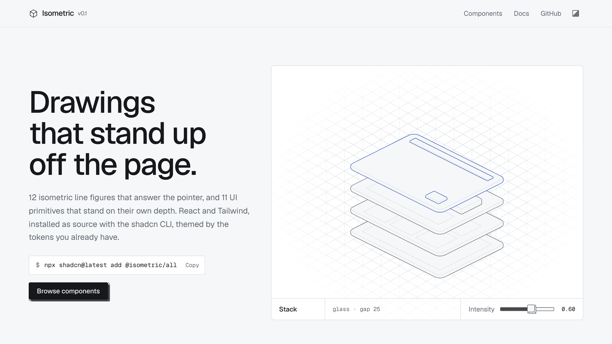
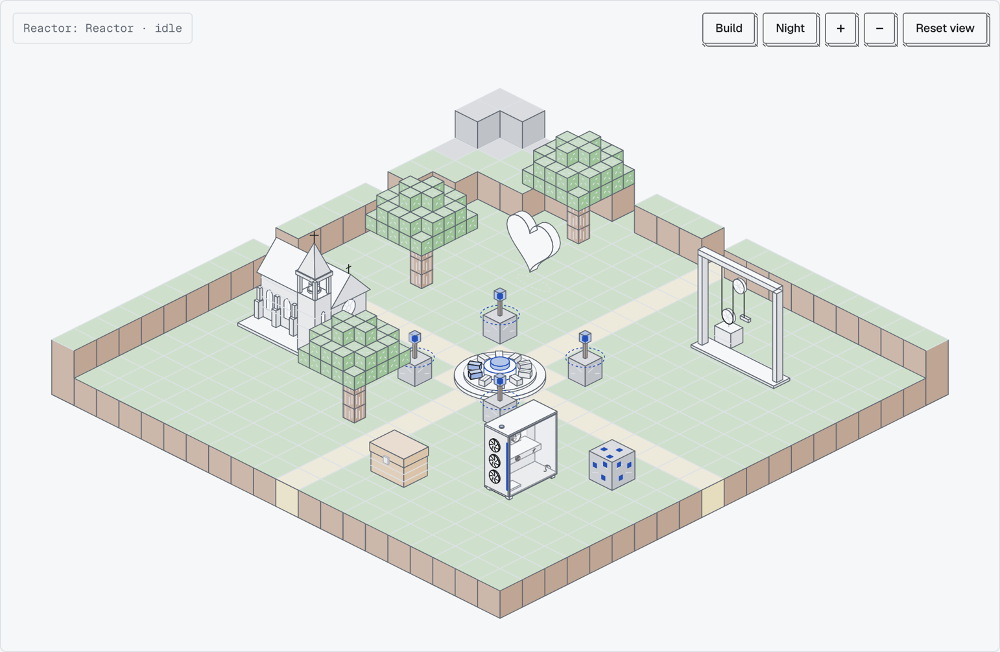

<div align="center">
  <a href="https://isometric.buildlab.in">
    
  </a>
  <p style="font-size: 32px;">Isometric</p>
  <p>Isometric line figures and UI primitives for React.</p>
  <p>
    <a href="https://isometric.buildlab.in">Website</a> ·
    <a href="https://isometric.buildlab.in/components">Components</a> ·
    <a href="https://isometric.buildlab.in/playground">Playground</a> ·
    <a href="https://isometric.buildlab.in/llms.txt">llms.txt</a> ·
    <a href="./CHANGELOG.md">Changelog</a> ·
    <a href=".github/CONTRIBUTING.md">Contributing</a>
  </p>
  <p>
    <a href="./LICENSE"></a>
    <a href="https://github.com/Abhishek-Mallick/Isometric/actions/workflows/ci.yml"></a>
  </p>
</div>

<br />

<a href="https://isometric.buildlab.in">
  <picture>
    <source media="(prefers-color-scheme: dark)" srcset=".github/assets/hero-dark.png" />
    
  </picture>
</a>

<br />

Isometric is a collection of drawings and controls that stand in three dimensions, drawn in fine lines. The **figures** are SVG drawings that answer the pointer: a skyline that rises where you point, a laptop whose lid follows you, a bar chart drawn from your data. The **interactive objects** are made of parts you can operate: slide the panel off a PC, ring a church bell, haul a pulley. The **Blocks** kit is mineable blocks with game UI to match, and the **World** puts everything in one town you can explore and build in. The **primitives** are buttons, cards, tabs and the rest, each standing on a depth drawn in the same lines. You install the source with the shadcn CLI, so every component is yours to edit.

## What's included

- **12 figures**: Skyline, Stack, Keys, Rack, Laptop, Bars, Steps, Files, Cylinders, Parcel, Nodes and Cube. Each takes the same options (`intensity`, `theme`, `label`, `onRead`) and reads out what it is doing.
- **5 interactive objects**: PC Case, Heart, Reactor, Pulley and Church. Every part answers a click and the keyboard, and reports through `onActivate`.
- **The Blocks kit**: Block, Chest, Torch and Tree, with a Block Icon, Hotbar, Inventory, Hearts Meter and XP Bar.
- **World**: a town of every object on block terrain, with pan, zoom, day and night, and a build mode. See it in the [playground](https://isometric.buildlab.in/playground).
- **11 primitives**: Button, Card, Switch, Tabs, Slider, Toggle Group, Kbd, Badge, Progress, Input and Grid, built on Radix UI with keyboard and screen-reader support.
- **A small engine** (`lib/isometric`): orthographic projection, meshes with hidden faces removed and true outlines for curved solids, picking, springs, and one shared animation loop that sleeps offscreen and when nothing moves. No dependencies beyond React.
- **Your theme, unchanged.** Everything reads shadcn's tokens, so it follows your palette and `.dark`. Tune it with `--iso-*` custom properties.
- **Docs for humans and agents**: every component page has a live preview, install command, props table and source, plus [`llms.txt`](https://isometric.buildlab.in/llms.txt) and per-component Markdown.

## Components

| Figures | | Primitives | |
| --- | --- | --- | --- |
| [Skyline](https://isometric.buildlab.in/components/skyline) | Towers rise around the pointer | [Iso Button](https://isometric.buildlab.in/components/iso-button) | Stands on its depth, sinks when pressed |
| [Stack](https://isometric.buildlab.in/components/stack) | An app window in four layers | [Iso Card](https://isometric.buildlab.in/components/iso-card) | A slab, composed like shadcn's Card |
| [Keys](https://isometric.buildlab.in/components/keys) | A keyboard that presses back | [Iso Switch](https://isometric.buildlab.in/components/iso-switch) | A block in a recessed groove |
| [Rack](https://isometric.buildlab.in/components/rack) | Server units slide out | [Iso Tabs](https://isometric.buildlab.in/components/iso-tabs) | The chosen tile stands up |
| [Laptop](https://isometric.buildlab.in/components/laptop) | The lid follows the pointer | [Iso Slider](https://isometric.buildlab.in/components/iso-slider) | A cube on a rail, with ticks |
| [Bars](https://isometric.buildlab.in/components/bars) | A bar chart from your data | [Iso Toggle Group](https://isometric.buildlab.in/components/iso-toggle-group) | Keys that stay down when on |
| [Steps](https://isometric.buildlab.in/components/steps) | Progress as a staircase | [Iso Kbd](https://isometric.buildlab.in/components/iso-kbd) | A keycap for shortcuts |
| [Files](https://isometric.buildlab.in/components/files) | Sheets rise from a folder | [Iso Badge](https://isometric.buildlab.in/components/iso-badge) | A small slab for status |
| [Cylinders](https://isometric.buildlab.in/components/cylinders) | A database stack that parts | [Iso Progress](https://isometric.buildlab.in/components/iso-progress) | Blocks that stand up as they fill |
| [Parcel](https://isometric.buildlab.in/components/parcel) | A box that opens as you near | [Iso Input](https://isometric.buildlab.in/components/iso-input) | A recessed well |
| [Nodes](https://isometric.buildlab.in/components/nodes) | A pulse routes through a network | [Iso Grid](https://isometric.buildlab.in/components/iso-grid) | An isometric lattice backdrop |
| [Cube](https://isometric.buildlab.in/components/cube) | Layers twist and settle | | |

### Interactive objects and Blocks

| Objects | | Blocks | |
| --- | --- | --- | --- |
| [PC Case](https://isometric.buildlab.in/components/pc-case) | Panel off, memory out, power on | [Block](https://isometric.buildlab.in/components/block) | Mine it; it grows back |
| [Heart](https://isometric.buildlab.in/components/heart) | Beats, and likes with a burst | [Chest](https://isometric.buildlab.in/components/chest) | The lid lifts, items rise |
| [Reactor](https://isometric.buildlab.in/components/reactor) | Coils charge, pulses fire | [Torch](https://isometric.buildlab.in/components/torch) | Flickers; snuff and relight |
| [Pulley](https://isometric.buildlab.in/components/pulley) | Haul the rope, 2:1 or 4:1 | [Tree](https://isometric.buildlab.in/components/tree) | Sways, sheds leaves |
| [Church](https://isometric.buildlab.in/components/church) | Doors, bell and lit windows | [Hotbar](https://isometric.buildlab.in/components/hotbar) · [Inventory](https://isometric.buildlab.in/components/inventory) · [Hearts Meter](https://isometric.buildlab.in/components/hearts-meter) · [XP Bar](https://isometric.buildlab.in/components/xp-bar) | Game UI to match |

<a href="https://isometric.buildlab.in/playground">
  <picture>
    <source media="(prefers-color-scheme: dark)" srcset=".github/assets/playground-dark.png" />
    
  </picture>
</a>

## Installation

Isometric needs React 19, Tailwind CSS v4 and a `components.json` (run `npx shadcn@latest init` first).

```bash
npx shadcn@latest add @isometric/skyline @isometric/iso-button
npx shadcn@latest add @isometric/church @isometric/world
npx shadcn@latest add @isometric/all   # everything
```

If your shadcn CLI does not know the namespace yet, register it in `components.json`:

```json
{
  "registries": {
    "@isometric": "https://isometric.buildlab.in/r/{name}.json"
  }
}
```

## Usage

```tsx
import { Bars } from "@/components/ui/isometric/bars"
import { IsoButton } from "@/components/ui/isometric/iso-button"

export default function Page() {
  return (
    <>
      <Bars data={[12, 18, 9, 24]} labels={["Q1", "Q2", "Q3", "Q4"]} intensity={0.7} />
      <IsoButton variant="solid">Get started</IsoButton>
    </>
  )
}
```

## Theming

```css
:root {
  --iso-accent: #2450b8; /* what the pointer touches */
  --iso-plate: var(--background); /* the fill of every face */
  --iso-stroke: 0.9; /* stroke width in CSS px */
  --iso-side: var(--muted); /* the side faces of primitives */
}
```

See [the docs](https://isometric.buildlab.in/docs#theming) for every token.

## Development

```bash
pnpm install
pnpm dev          # generates the registry, then runs the site on :3000
pnpm test         # engine and registry tests
pnpm build        # name check, registry, static export to out/
pnpm test:e2e     # browser smoke tests against out/
```

The registry is generated from [`registry/index.ts`](registry/index.ts). Components live in `registry/isometric/ui/isometric`, the engine in `registry/isometric/lib/isometric`.

## License

[MIT](./LICENSE)
